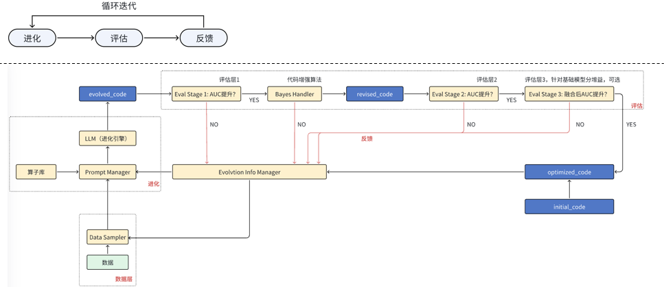
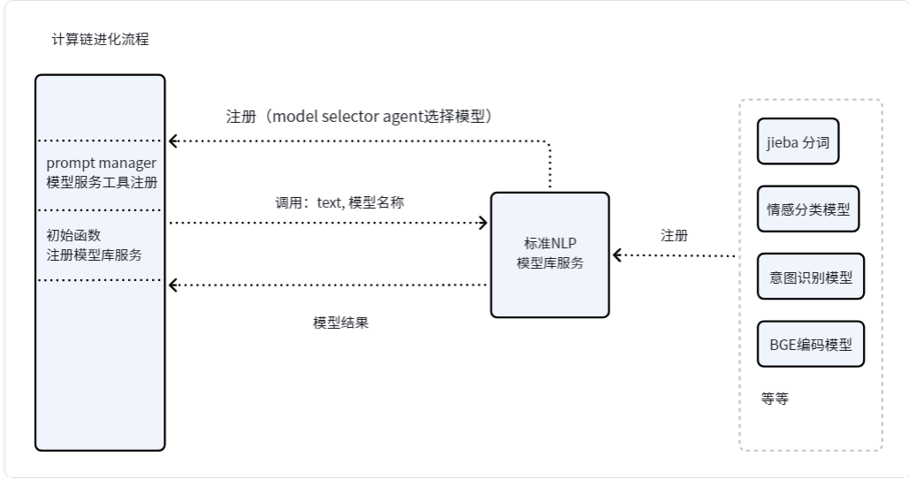
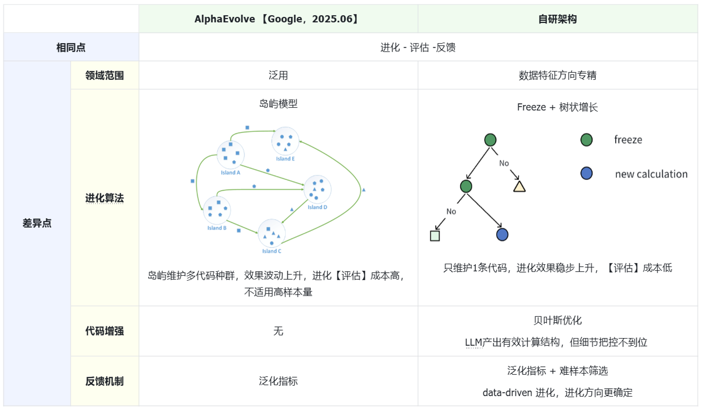
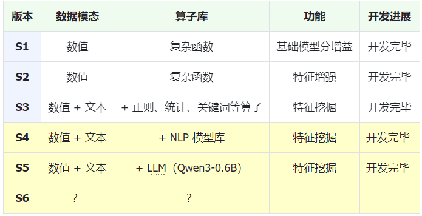

# 基于代码进化的结构化数据自动化挖掘系统

针对任意数值、文本模态结构化数据，实现计算逻辑自动化演进的智能体框架。

通过 **“代码进化 - 增强 - 评估 - 反馈”** 闭环机制，系统能够自主完成特征挖掘、特征增强，并显著提升主模型的指标增益（如 AUC、KS）。

---

## 🌟 核心理念

本项目摒弃了传统的固定特征工程算子，采用动态进化的思路：
1.  **代码进化**：利用 LLM 根据当前数据特征生成复杂的复合计算算子。
2.  **增强**：外接模型库服务（如 BGE 向量模型），增强代码处理复杂模态的能力。
3.  **评估**：在验证集上实时评估生成代码的增益指标。
4.  **反馈**：将评估结果反馈给 LLM，指导下一代代码的变异与交叉优化。

---

## 🏗️ 系统架构

### 1. 系统总体结构
系统由挖掘引擎、进化调度器、评估环境以及反馈环路组成。


### 2. 外接模型库服务
支持在生成的进化代码中动态调用外部深度学习服务（如 NLP 语义分析、向量检索等）。


---

## 🚀 技术创新点

相较于传统的 **AlphaEvolve** 等方案，本项目具有以下优势：

| 特性 | AlphaEvolve | SmartEvolve-Agent (本项目) |
| :--- | :--- | :--- |
| **挖掘效率** | 较低（算子空间受限） | **极高**（LLM 生成无限算子空间） |
| **模态支持** | 主要是数值型 | **全模态**（数值、文本、半结构化） |
| **指标优化** | AUC/KS 提升有限 | **深度优化**（针对子分挖掘，指标更优） |
| **扩展性** | 闭环算子库 | **开放生态**（可外调向量模型、外部 API） |

> **对比分析图：**
> 

---

## 🔍 挖掘模式

支持对任意数值、文本模态的结构化数据进行深度挖掘。


---

## 💻 生成代码示例 (Case Study)

### 案例 1：反备注信息深度挖掘
自动生成的代码展现了对复杂字符串的分隔、关键词统计以及非线性复合算子（如 `sqrt` 与 `log` 的交互）的运用。

```python
def calculate_probability(data):
    import math
    import numpy as np
    # ... 自动化生成的复杂交互逻辑 ...
    # 计算正负特征及交互值
    negative_feature = log_b * np.float64(3.235) + log_d * np.float64(10.0)
    positive_feature = f_count * np.float64(11.729) + g_val * np.float64(10.0)
    interaction = positive_feature * np.float64(-8.197) + negative_feature * np.float64(-10.0)

    # 复合算子生成调整分
    score_adjust = np.float64(0.1) * math.sqrt(abs(interaction)) * np.sign(interaction)
    return score_before_normalized, prob
